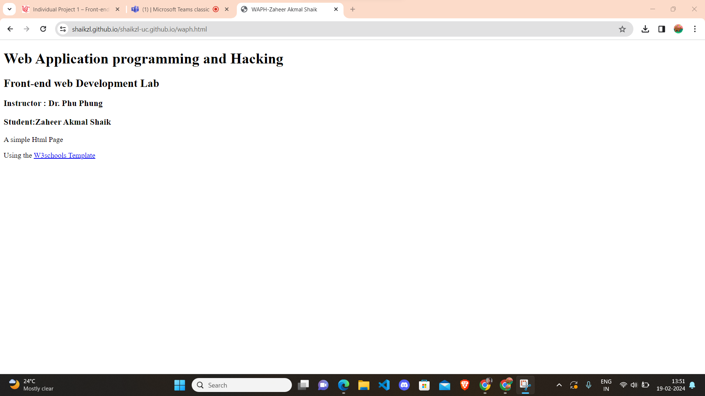
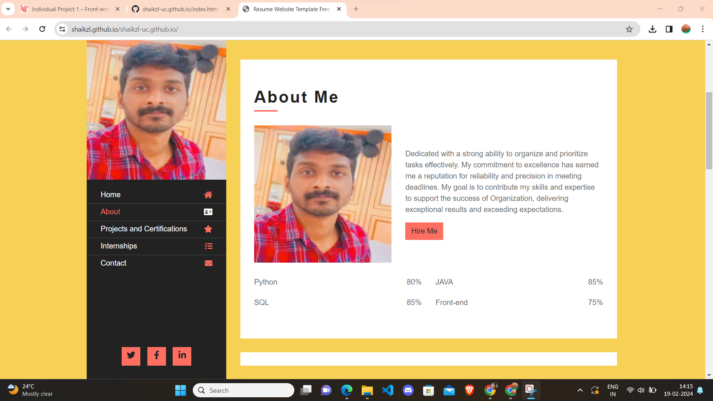
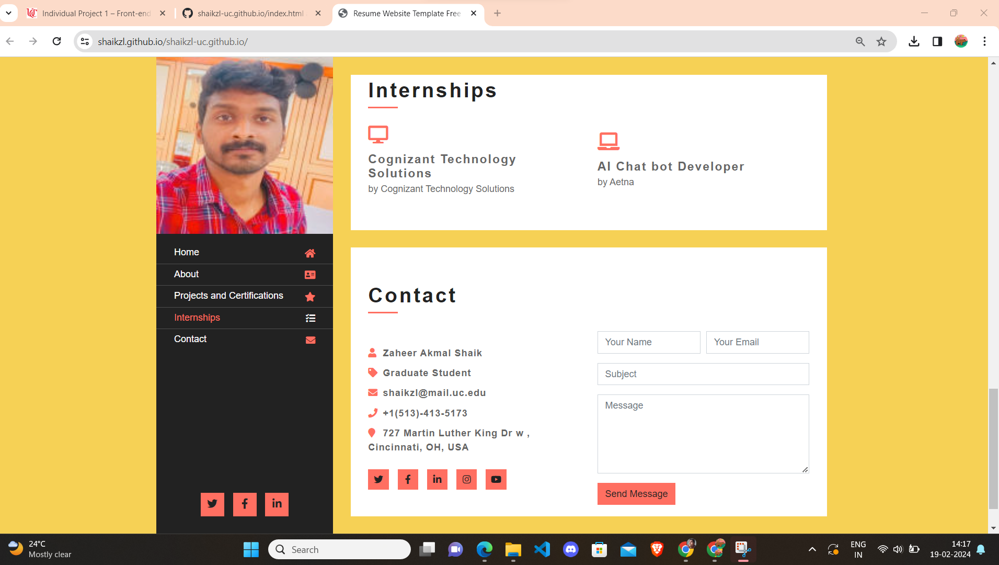
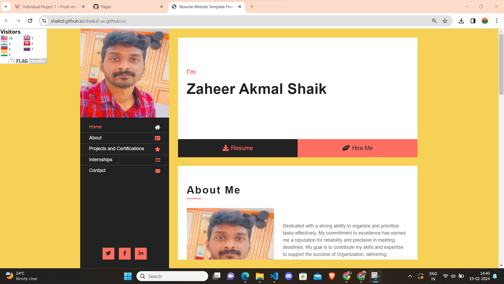
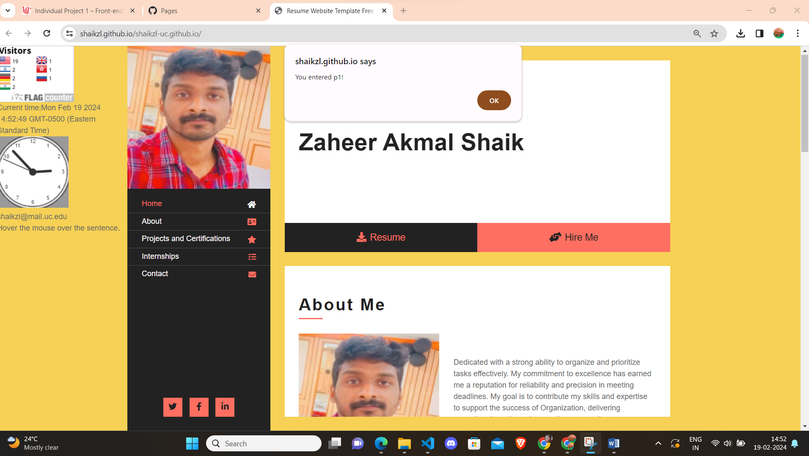
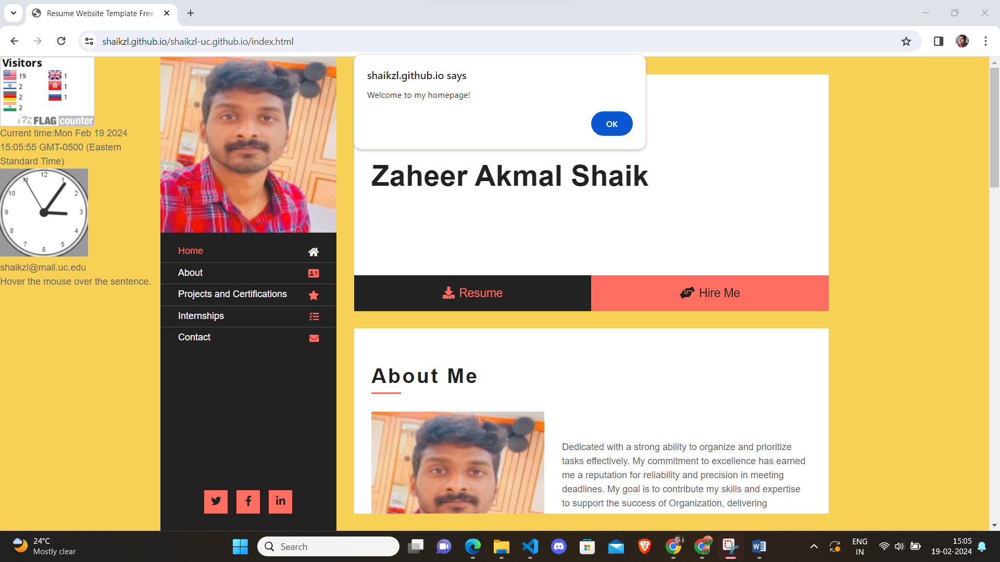

# WAPH-Web Application Programming and Hacking

## Instructor: Dr. Phu Phung
## Student

**Name**: Zaheer Akmal Shaik

**Email**: shaikzl@mail.uc.edu

**Short-bio**: I have great intrest towards ethical hacking. 

https://shaikzl.github.io/shaikzl-uc.github.io/index.html

 

In the Snap-1, I created a WAPH HTML file and i have inserted details about the course contents and introduction of me.

snap - 2, I employed the Bootstrap CSS framework for creating my website more flexible and accessible. I sped up the development of layouts and elements by utilizing Bootstrap's grid structure and already assembled UI components such as buttons, navbars, and cards. In order to reduce the need for bespoke CSS, I used Bootstrap's utility classes for dealing with typography, color improvements, spacing, and scaling. In addition, I chose a Bootswatch theme, which is free and open-source, and effortlessly linked it with a content delivery network (CDN) to access pre-defined CSS styles for enhancing the overall look of my site.

In snap 3 and 4,Expanding upon my utilization of the Bootstrap framework with my educational background and projects and certifications, I integrated Bootstrap's robust CSS framework into my website development process

In snap-5, extension to the bootstrap providing my inetrship and my cotact details for the recruters

In snap 6, To track the no of visits to my portfolio, I added the flag counter

Snap-7,8 - I incorporated several jQuery operations into the webpage: a digital clock, an analog clock, and an email onclick function. Additionally, I implemented a hover feature on a sentence, triggering the display of an error message containing the provided information.

In Snap-9, there's a JavaScript cookie feature set up to trigger an alert message when a user visits the page for the first time.

Screenshot-9 showcases a JavaScript cookie functionality that presents an alert upon the user's return to the page, indicating their previous visit along with the respective date and time.
