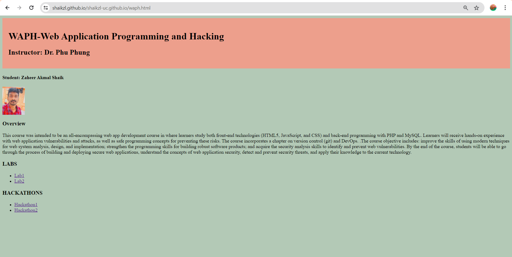
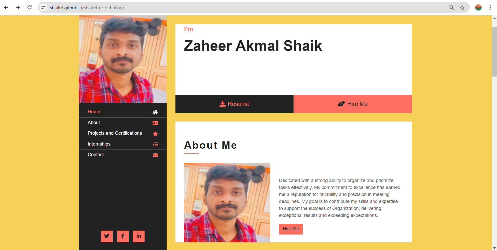
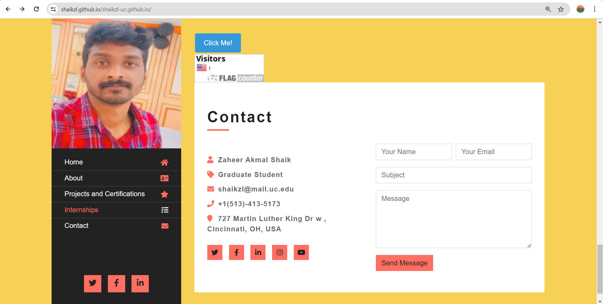
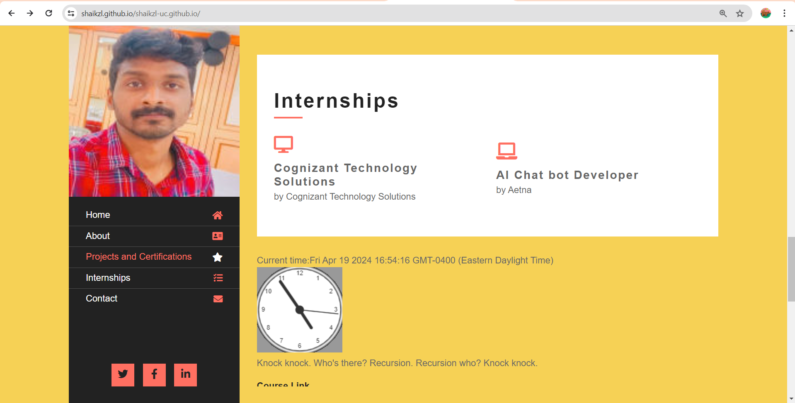
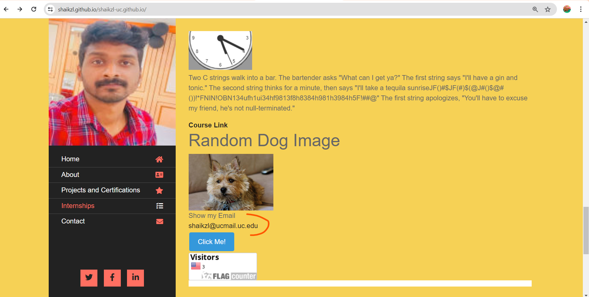
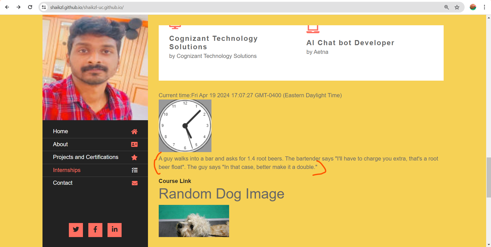
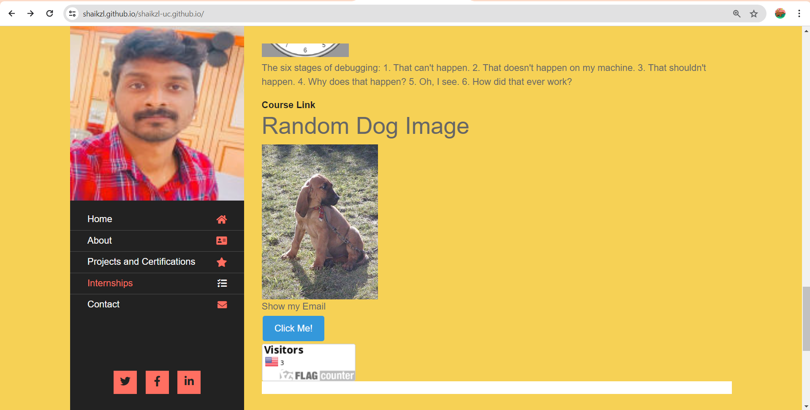
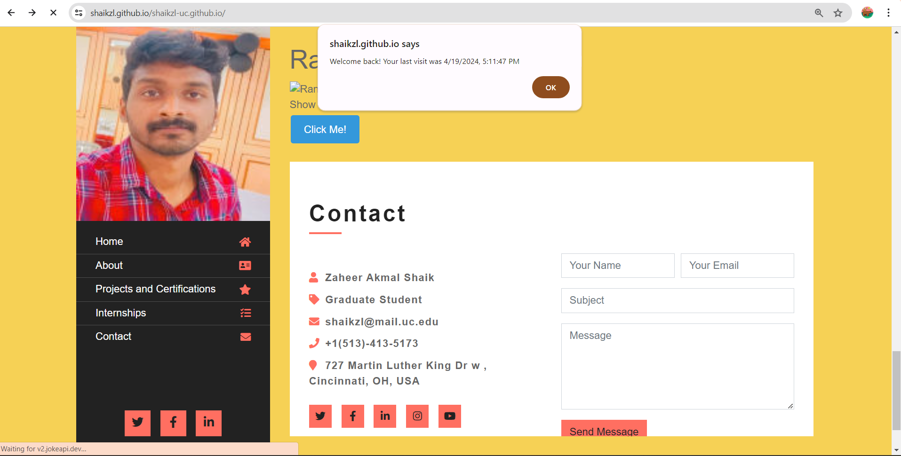

# WAPH-Web Application Programming and Hacking

## Instructor: Dr. Phu Phung
## Student

**Name**: Zaheer Akmal Shaik

**Email**: shaikzl@mail.uc.edu

**Short-bio**: I have great intrest towards ethical hacking. 


https://shaikzl.github.io/shaikzl-uc.github.io/index.html

https://github.com/shaikzl/shaikzl-uc.github.io

 

 I created a WAPH HTML file and i have inserted details about the course contents and introduction of me.


I employed the Bootstrap CSS framework for creating my website more flexible and accessible. I sped up the development of layouts and elements by utilizing Bootstrap's grid structure and already assembled UI components such as buttons, navbars, and cards. In order to reduce the need for bespoke CSS, I used Bootstrap's utility classes for dealing with typography, color improvements, spacing, and scaling. In addition, I chose a Bootswatch theme, which is free and open-source, and effortlessly linked it with a content delivery network (CDN) to access pre-defined CSS styles for enhancing the overall look of my site.


Expanding upon my utilization of the Bootstrap framework with my educational background and projects and certifications an Interships, I integrated Bootstrap's robust CSS framework into my website development process.

Included a page tracker using flagcounter to count the number of visitors
to the page. Included this counter at the bottom of the page.



```
<div><a href="http://s11.flagcounter.com/more/OCo">
</a></div>
```




I incorporated  jQuery operations into the webpage: a digital clock, an analog clock, and an email onclick function.

I used jquery to create a click me button which changes its colour everytime when we click on it.

```
<button id="colorfulButton">Click Me!</button>
<script>
$(document).ready(function(){
    // When the button is clicked
    $("#colorfulButton").click(function(){
        // Generate a random color
        var randomColor = '#'+(Math.random()*0xFFFFFF<<0).toString(16);
        // Change the background color of the button
        $(this).css("background-color", randomColor);
    });
});
</script>

```

### API Integration 

I inserted the public jokeAPI that displays a new joke every minute. Ajax was utilized to make the API get request.



Used a public API named dogapi to get dog images when requested.



```
// Function to fetch a random dog image from the Dog API
        function fetchRandomDogImage() {
            fetch('https://dog.ceo/api/breeds/image/random')
                .then(response => response.json())
                .then(data => {
                    const imageUrl = data.message;
                    // Update the src attribute of the img
                     element with the fetched image URL
                    document.getElementById('dog-image').src = imageUrl;
                })
                .catch(error => console.error('Error fetching random
                          dog image:', error));
        }

        // Call the fetchRandomDogImage function when the page loads
        fetchRandomDogImage();
```

JavaScript cookie feature set up to trigger an alert message when a user visits the page for the first time and also a JavaScript cookie functionality that presents an alert upon the user's return to the page, indicating their previous visit along with the respective date and time.


